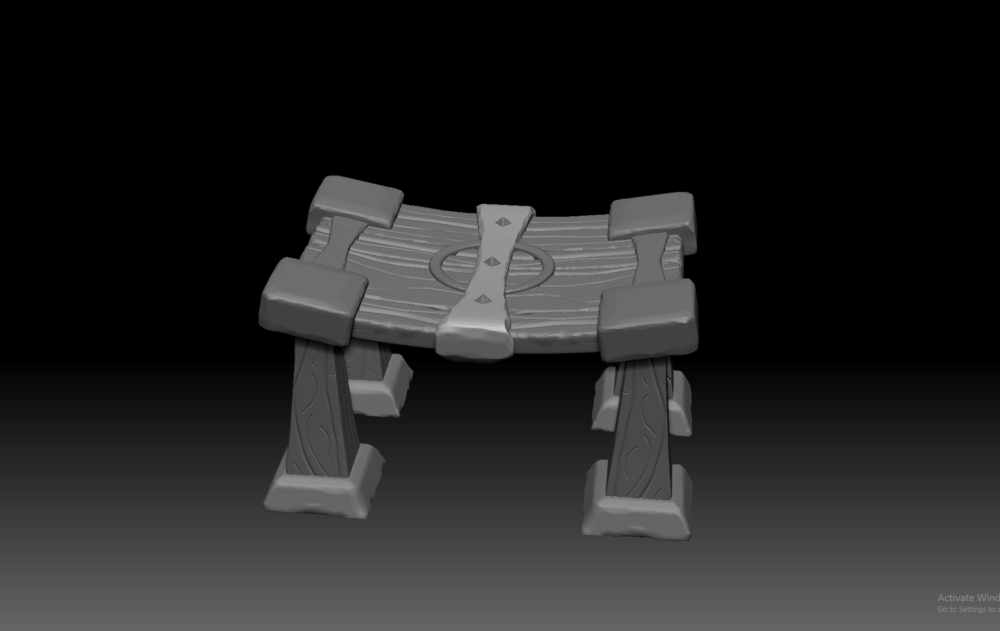
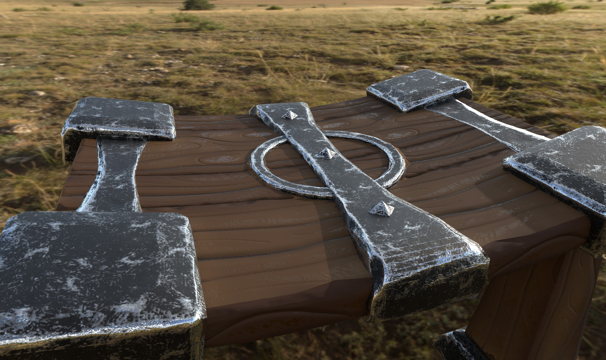
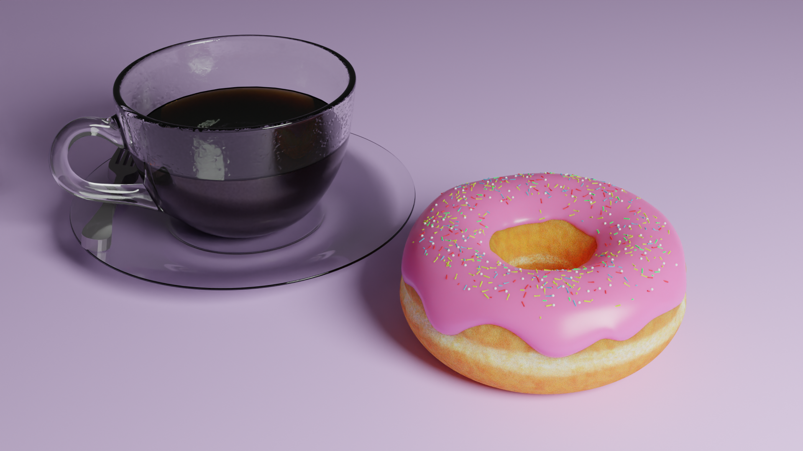

# Caleb Deters Portfolio

## Unity Development
The Cleaner is a project of mine for a class. I have provided some of the scripts that I have written for this game.

Here is a [video](https://youtu.be/VoRz7awg_Ms) showing the game in Unity running

### Enemy Controls

For Attacking the player I have designed a baton system where the enemies take turns attacking the player. This was not as fast paced as I would of liked and so I changed it to where every enemy can attack at the same time but they they have a delay in between their attacks. Letting the player focus on the other enemies

### Fog of War

The Fog of War System is how the minimap is rendered. Any mesh with the FOV layer will be cut out of the Fog texture map. The FOVMeshStatic.cs creates this mesh procedurally to conform against the walls of the level

### Glow Charge

The Glow charge is an ability of the player where they throw out an orb that lights the map around them and also calls FOVMeshStatic.

## Unreal Development

Here is an example [video](https://youtu.be/JJBuSpKaVXM) on a world I built in Unreal where the restrictions was the only mechanic allowed was movement

## Maya Modeling

### Hallway Project

### Stylized Table Project

## Blender Modeling

### Cup of Coffee Project

